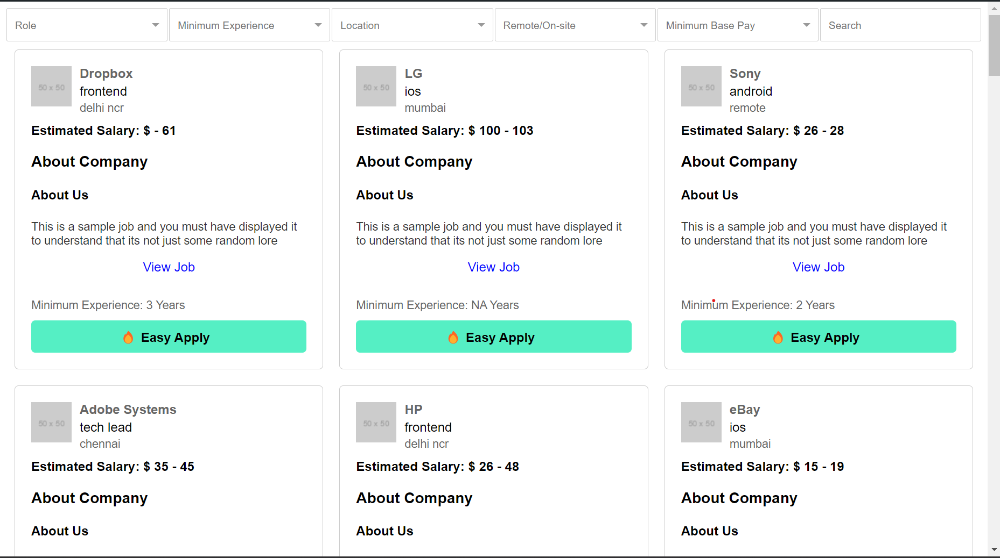

# Candidate Application Platform

This project is a candidate application platform that allows users to view job listings, filter jobs based on various criteria, and implement infinite scroll for a seamless browsing experience. The platform provides a user-friendly interface for viewing and applying to jobs.

## Features

### Job Cards

Each job listing is displayed as a card containing the following information:
- Job title
- Company name
- Location
- Job description (limited to a certain number of characters with an option to expand)
- Experience required
- Apply button/link

### Filters

Filters are implemented to allow users to refine the job listings based on the following criteria:
- Minimum experience
- Company name
- Location
- Remote/on-site
- Tech stack
- Role
- Minimum base pay

### Infinite Scroll

Infinite scroll is implemented to load additional job listings as the user scrolls down the page. The platform fetches and displays more jobs automatically without requiring the user to click on a "Load More" button.

### Responsive Design

The platform is responsive and works well on different screen sizes, including mobile devices.

## Installation

1. Clone the repository: `git clone https://github.com/Amiyanshu-web/weekday.git`

2. Navigate to the project directory: `cd weekday`

3. Install dependencies: `npm install`

4. Run the development server: `npm start`

5. Open your browser and visit `http://localhost:3000` to view the application.

## Technology Stack

The following technology stack is used for this project:
- ReactJs
- Redux
- CSS
- Material UI

## Usage

1. Browse through the job listings on the platform.
2. Use the filters to refine the job listings based on your preferences.
3. Scroll down the page to load additional job listings automatically.
4. Click on the "Apply" button/link to apply to a job.
